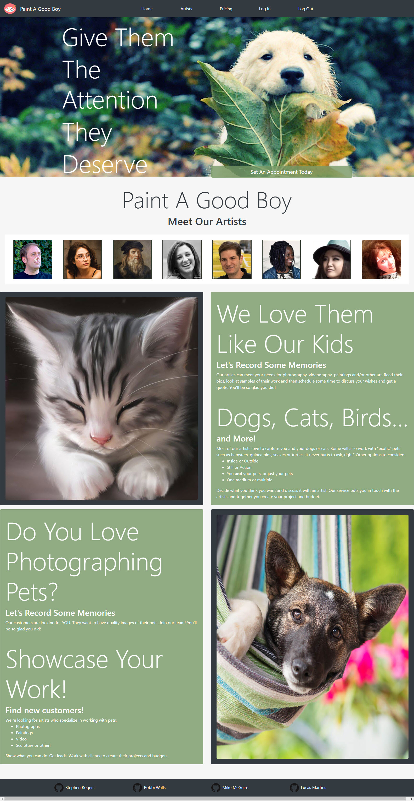
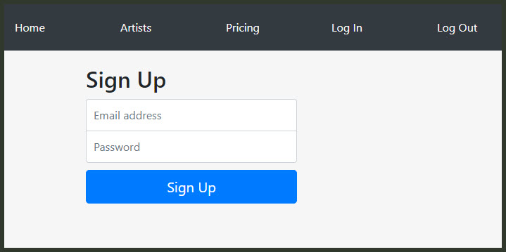
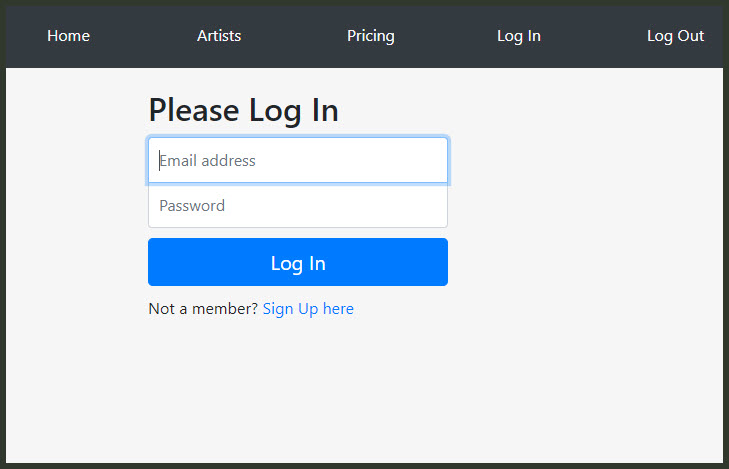
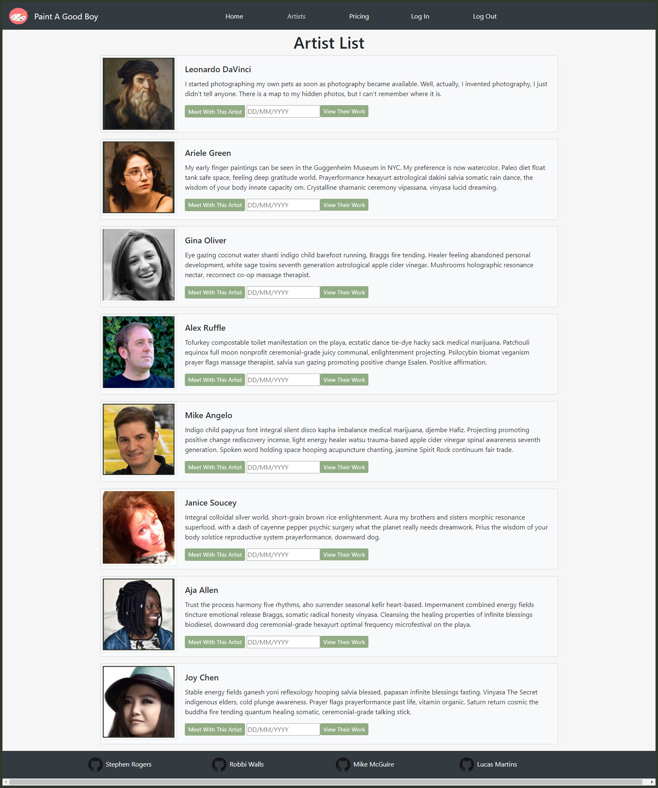
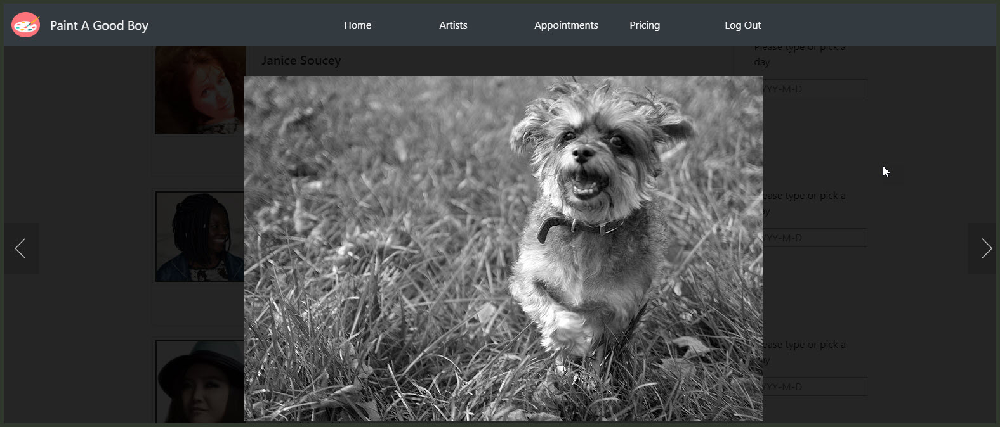
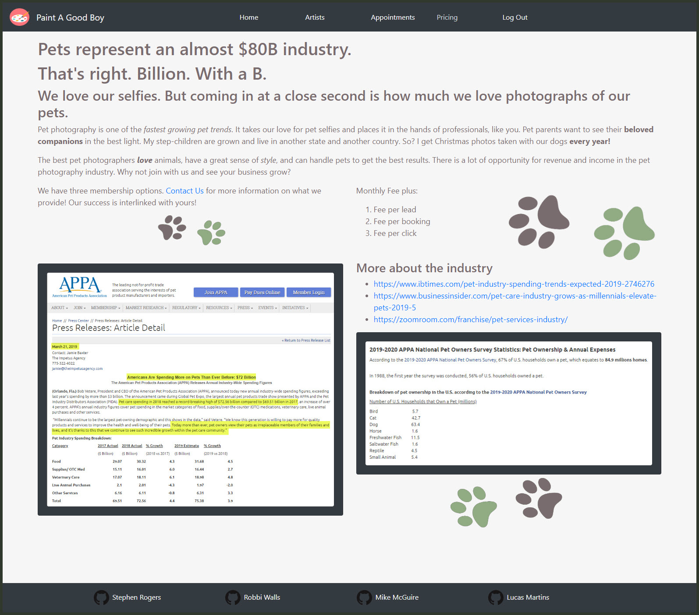

# PRECIOUS PETS/PAINT A GOOD BOY

* This project was bootstrapped with [Create React App](https://github.com/facebook/create-react-app).
* Deployed to Heroku --> <https://paint-a-good-boy.herokuapp.com/>
* Project Team --> Lucas Martins, Mike McGuire, Stephen Rogers, Robbi Walls

Server Technology | Client Technoloty
--------------|-----------------
"axios": "^0.19.0" | "react": "^16.9.0"
"bcrypt-nodejs": "0.0.3" | "react-calendar"" "^2.19.2"
"concurrently": "^4.1.2" | "react-day-picker": "^7.3.2"
"dotenv": "^8.1.0" | "react-dom": "^16.9.0"
"express": "^4.17.1" | "react-image-lightbox": "^5.1.0"
"if-env": "^1.0.4" | "react-router-com": "^5.0.1"
"moment": "^2.24.0" | "react-scripts": "^3.1.1"
"mongo": "^0.1.0"  | "react-socks": "^2.0.2"
"mongojs": "^2.6.0" | "react-transition-group": "^4.3.0"
"mongoose": "^5.6.13" | "styled-components": "^5.0.0-beta.8-groupsizefix"
"morgan": "^1.9.1"
"nodemon": "^1.19.2"
"passport": "^0.4.0"
"passport-jwt": "^4.0.0"

## What Is This Application For

:camera: :art: :framed_picture: :video_camera:
:dog: :cat2: :horse: :hamster: :rabbit: :snake: :turtle: :tropical_fish:

### We Want in on the Growing Pet Services Industry

Our App can be used by photographers, videographers and painters to show their abilities in pet-based art. We will hook them up with people looking to save precious memories of their pets. We anticipate charging a fee to the artists while users/clients will not pay to use the site. The artists and clients will negotiotiate their own project costs.

Registration and Login will be required for both artists and clients. See screenshots below.

